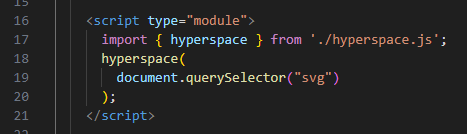

# HyperSpace

A finite SVG grid with pan and zoom functionality.

# How to Use

1. With `hyperspace.js` in the same directory, import and call `hyperspace` and pass in an `svg` element.
2. The `svg` element will then be a grid approximatly three times the size of the svg viewport that can pan and zoom with mouse. 

# Why use This

Edit the source of `hyperspace` as needed to add functionality like the abiltiy to add shapes, create graphs, or diagrams. 

# Demo Video
[Demo Video](https://youtu.be/QLrJZMc7E8s)

# Screenshot

Imagine this, but you can pan and zoom:

